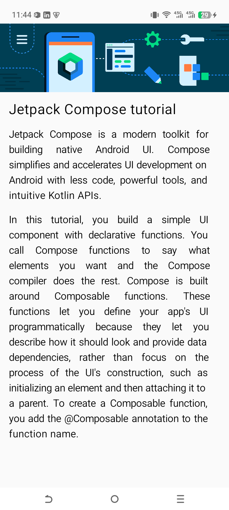

# 🚀 Kotlin & Android Compose Journey

Welcome to my personal learning hub! This repository is a curated collection of Android applications and Kotlin logic exercises I've built while mastering **Modern Android Development** with **Jetpack Compose**.

This isn't just a folder of code—it's a showcase of my growth from basic layouts to interactive, state-driven mobile applications.

---

## 🎨 Application Showcase

Explore the individual projects below. Each link will take you directly to the source code and detailed documentation for that specific app.

| Project Name | Preview | Description |
| :--- | :---: | :--- |
| **[06. Dice Roller App](./app/src/main/java/com/example/kotlinprogramming/practice/app7_diceroller)** | *(Preview Coming Soon)* | Introducing **State**! An interactive app where UI updates based on user clicks. |
| **[05. Business Card App](./app/src/main/java/com/example/kotlinprogramming/practice/app6_business_card_app)** | *(Preview Coming Soon)* | A custom-branded business card UI practicing Icons and Material Design. |
| **[04. Compose Quadrant](./app/src/main/java/com/example/kotlinprogramming/practice/app4_compose_quadrant)** |  | Mastering the `Weight` modifier to create a perfect 2x2 responsive grid. |
| **[03. Task Manager](./app/src/main/java/com/example/kotlinprogramming/practice/app3_task_manager)** |  | A clean "Task Completed" UI focusing on vertical/horizontal centering. |
| **[02. Compose Article](./app/src/main/java/com/example/kotlinprogramming/practice/app2_compose_article)** |  | Learning structured content with Columns, padding, and text justification. |
| **[01. Happy Birthday App](./app/src/main/java/com/example/kotlinprogramming/practice/app1_happy_birthday)** |  | My first step into Compose! Focused on Text, Images, and basic Box layouts. |

---

## 📂 Project Architecture

The repository is organized into two core modules to keep logic and UI separate:

### 📱 1. `:app` (Android Application)
This is where the Compose magic happens.
- **Path**: `app/src/main/java/com/example/kotlinprogramming/practice/`
- **Focus**: UI/UX Design, State Management, Material 3, and Responsive Layouts.

### 💻 2. `:lib` (Kotlin JVM Library)
The engine room where I practice core Kotlin logic.
- **Path**: `lib/src/main/java/com/example/lib/kotlinFundamentals/`
- **Focus**: OOP, Collections, Lambda functions, and complex problem-solving.

---

## 🛠 Tech Stack & Tools
- **Language**: Kotlin 1.9+
- **UI Framework**: Jetpack Compose (Modern Toolkit)
- **Theme**: Material Design 3
- **Build System**: Gradle (Kotlin DSL)
- **IDE**: Android Studio

---

## 📖 How to Explore
1. **Browse**: Click on any project name in the table above to view its specific logic.
2. **Build**: Clone the repo and run the `:app` module to see the launcher in action.
3. **Learn**: Check the `README.md` inside each sub-folder for detailed technical notes on what was learned in that specific app.

---
*“Modern Android development is about creating beautiful, functional experiences with less code and more intuition.”* 🚀✨
