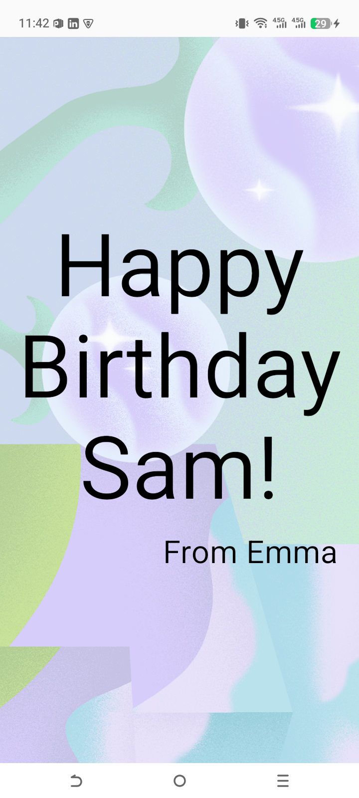

# 🎂 Happy Birthday App

This is my first Android application developed while learning the basics of Jetpack Compose. It focuses on understanding UI components and layout structures.

## 🚀 What I Learned
- **Composables**: How to use `Text` and `Image` components.
- **Layouts**: Mastering `Box` and `Column` for layering and stacking elements.
- **Resources**: Managing strings and drawable resources efficiently.
- **Modifiers**: Applying padding and alignment to UI elements.

## 🛠 Features
- Full-screen background image using `ContentScale.Crop`.
- Layered text elements with custom font sizes and alignment.
- Support for system back-navigation.

## 📸 Final Look

---

*Created with ❤️ while learning Jetpack Compose.*