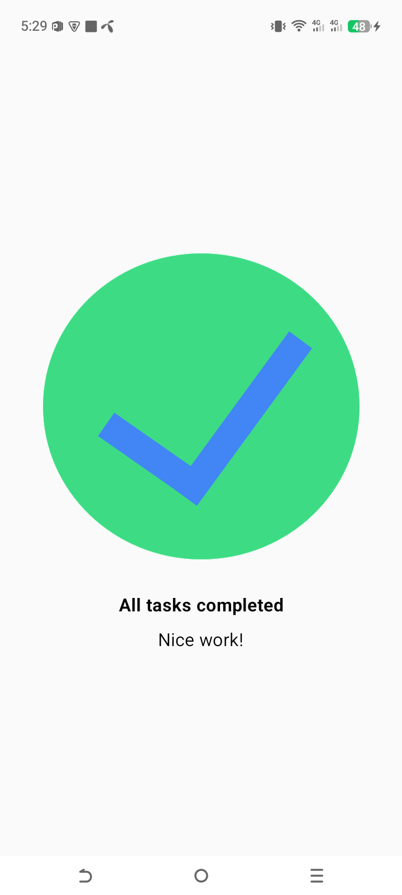

# ✅ Task Manager App

This application displays a "Task Completed" screen. It is part of my journey in learning Jetpack Compose, focusing on layout alignment and precise UI positioning.

## 🚀 What I Learned
- **Vertical and Horizontal Centering**: Using `Arrangement.Center` and `Alignment.CenterHorizontally` within a `Column` to perfectly center content on the screen.
- **Typography and Styling**: Applying `FontWeight.Bold` and specific `fontSize` (e.g., `16.sp`) to differentiate between titles and descriptions.
- **Precise Spacing**: Using `Modifier.padding` with specific side values (e.g., `top = 24.dp, bottom = 8.dp`) to achieve the desired visual hierarchy.
- **Screen Filling**: Using `fillMaxWidth()` and `fillMaxHeight()` to ensure the UI occupies the entire available space.

## 🛠 Features
- Displays a checkmark icon indicating task completion.
- Bold "All tasks completed" status message.
- Supportive "Nice work!" sub-text.
- Responsive design that centers content regardless of screen size.

## 📸 Preview

