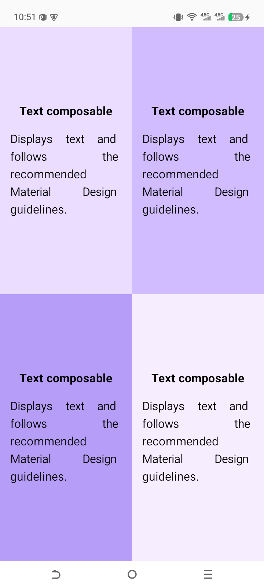

# 📱 Compose Quadrant App

## 🌟 Project Overview
The **Compose Quadrant** app is a fundamental practice project designed to master the art of UI layouts in Jetpack Compose. The goal is to divide the screen into four equal parts (quadrants), each displaying a different title and description with a unique background color.

This project is a fantastic way to learn how to manage screen real estate and reuse UI components effectively.

---

## 🛠️ What I Learned (Key Concepts)

### 1. **The Power of `Weight` Modifier**
The most important lesson here is `Modifier.weight(1f)`. 
- By applying `weight(1f)` to both `Rows` inside a `Column`, the screen is split vertically into two equal halves.
- By applying `weight(1f)` to the `ComposableInfoCard` inside a `Row`, the row is split horizontally into two equal halves.
- Combined, they create a perfect **2x2 grid**.

### 2. **Component Reusability**
Instead of writing the code for a card four times, I created a single **Reusable Composable** called `ComposableInfoCard`. 
- It accepts parameters like `title`, `description`, and `backgroundColor`.
- This follows the **DRY (Don't Repeat Yourself)** principle, making the code cleaner and easier to maintain.

### 3. **Layout Nesting**
I learned how to nest layouts:
- **Main Column**: Holds the two rows.
- **Rows**: Hold the individual cards.
- **Card Column**: Manages the internal alignment (Center) of the text.

### 4. **Alignment & Arrangement**
- `verticalArrangement = Arrangement.Center`: Keeps content centered vertically.
- `horizontalAlignment = Alignment.CenterHorizontally`: Keeps content centered horizontally.
- `TextAlign.Justify`: Makes the description text look professional by stretching it to fill the line width.

---

## 🎨 Design Details

| Quadrant | Color Hex | Concept |
| :--- | :--- | :--- |
| Top Left | `#EADDFF` | Text Composable |
| Top Right | `#D0BCFF` | Image Composable |
| Bottom Left | `#B69DF8` | Row Composable |
| Bottom Right | `#F6EDFF` | Column Composable |

---

## 🚀 How the Code Works (Step-by-Step)

1.  **`ComposeQuadrantApp`**: This is the entry point. It sets up a `Column` with `safeDrawingPadding()` to ensure the UI doesn't hide behind system bars.
2.  **The Rows**: Two `Row` components are placed inside the Column. Each Row is given a `weight(1f)` so they share the height 50/50.
3.  **The Info Cards**: Inside each Row, two `ComposableInfoCard` units are placed. They also use `weight(1f)` to share the width 50/50.
4.  **Formatting**: Inside the card, `FontWeight.Bold` is used for titles and `16.dp` padding ensures the text isn't touching the edges.

---

## 📸 Final Look

---

*Created with ❤️ while learning Jetpack Compose.*