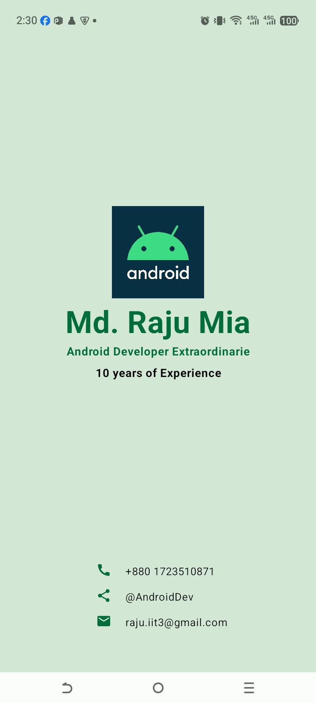

# 📇 Business Card App

## 🌟 Project Overview
The **Business Card App** is a creative project from the official Android Basics with Compose course. It focuses on building a personalized, professional UI that represents an individual's brand and contact information.

This project is a great way to practice balancing complex layouts and using Material Design icons.

---

## 🛠️ What I Learned (Key Concepts)

### 1. **Advanced `Column` & `Row` Nesting**
I learned how to structure a screen into logical sections:
- **Top/Center Section**: For the profile picture, name, and title.
- **Bottom Section**: For a list of contact details.
- I used `Modifier.weight(1f)` on the profile section to ensure it takes up the available space and pushes the contact info to the bottom.

### 2. **Material Icons**
I integrated standard Android **Material Icons** (`Call`, `Share`, `Email`) to make the contact section intuitive and professional.
- Used `Icon(imageVector = Icons.Filled.Email, ...)` to render vector assets.

### 3. **Branding with Colors**
- Applied a specific background color `0xFFD2E8D4` (a soft green) to match the official design.
- Used a contrasting dark green `0xFF006D3A` for text and icons to ensure readability and a cohesive theme.

### 4. **Text Hierarchy**
- **Headline**: Used a large `40.sp` bold font for the name to create a strong first impression.
- **Sub-headline**: Used smaller, bold text for the professional title and experience.

### 5. **Alignment & Precision**
- Practiced `Alignment.CenterHorizontally` for the profile section.
- Used `Alignment.Start` for the contact rows to ensure icons and text are perfectly aligned in a vertical column.

---

## 🚀 How the Code is Structured

1.  **`BusinessCardApp`**: The main container that sets the background color and divides the screen using weights.
2.  **`ProfileInfo`**: A dedicated composable for the branding elements (Logo + Name + Title).
3.  **`ContactInfo`**: A container for the list of contact rows.
4.  **`ContactRow`**: A reusable helper function that takes an `Icon` and `String` to create a consistent look for each contact method.

---

## 📸 Final Look

---
*Building this app made me realize how powerful simple layout tools are for creating professional-grade mobile interfaces.* 🚀✨