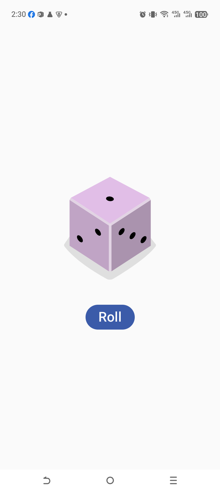

# 🎲 Dice Roller App

## 🌟 Project Overview
The **Dice Roller App** is a milestone project that moves beyond static layouts into the world of **Interactive Applications**. It simulates a real-world dice roll, where clicking a button randomly changes the dice face displayed on the screen.

This project is the foundation for understanding how data and UI stay in sync in Modern Android development.

---

## 🛠️ What I Learned (Key Concepts)

### 1. **State Management (`remember` & `mutableStateOf`)**
This is the most critical concept in Jetpack Compose!
- **State**: I learned that UI doesn't just change; it "reacts" to state changes.
- **`mutableStateOf`**: Used to create a variable that Compose "watches." When this value changes, the UI automatically updates (Recomposition).
- **`remember`**: Tells Compose to keep the value in memory even when the function is re-run, so we don't lose the current dice number.

### 2. **Conditional Logic in UI**
I used a `when` expression to dynamically decide which image resource to display based on the `result` state:
```kotlin
val imageResource = when (result) {
    1 -> R.drawable.dice_1
    2 -> R.drawable.dice_2
    // ...
    else -> R.drawable.dice_6
}
```

### 3. **Handling Click Events**
- I learned how to use the `onClick` parameter of a `Button`.
- Inside the click listener, I used `(1..6).random()` to generate a new value, which triggers the state update.

### 4. **Layout Centering**
- Used `Modifier.fillMaxSize().wrapContentSize(Alignment.Center)` to perfectly center the entire interactive component in the middle of the screen.
- Used `Spacer(modifier = Modifier.height(16.dp))` to add consistent breathing room between the image and the button.

---

## 🚀 How the Code Works

1.  **Initialize State**: A state variable `result` starts at 1.
2.  **Determine Asset**: The app calculates which dice image matches the current `result`.
3.  **User Action**: When the user taps the "Roll" button, the `result` variable is updated with a new random number.
4.  **Recomposition**: Because `result` is a State, Jetpack Compose automatically re-executes the code to show the new image.

---

## 📸 Final Look


---
*This project opened the door to building truly dynamic apps that respond to user input.* 🎲🔥