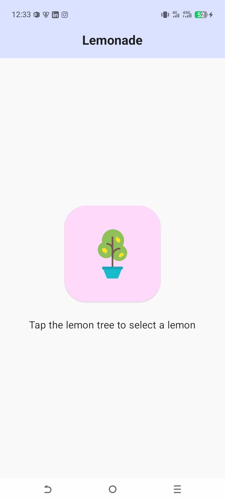
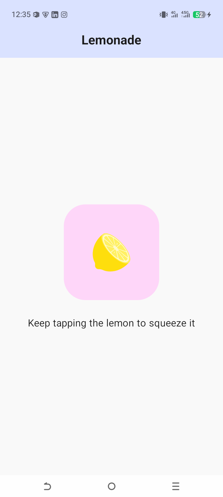
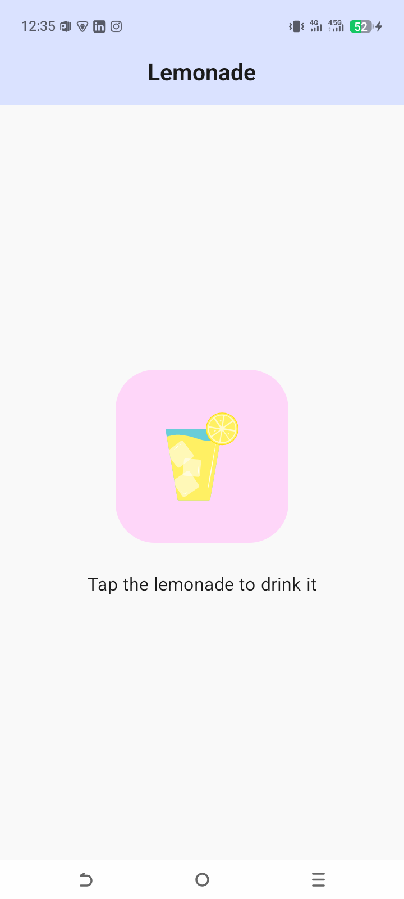
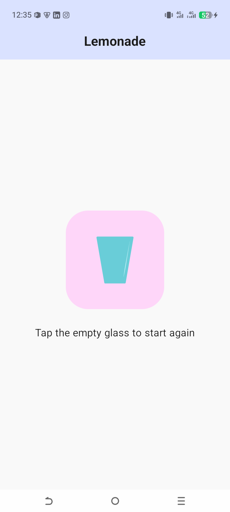

# 🍋 Lemonade App

## 🌟 Project Overview
The **Lemonade App** is an interactive, multi-step application that simulates the process of making lemonade—from picking a lemon to drinking it and restarting. This project is a major step forward in handling **Complex State Logic** and **UI Flow**.

It specifically focuses on how to transition between different "screens" or "states" within a single Composable.

---

## 🛠️ What I Learned (Key Concepts)

### 1. **Multi-Step State Logic**
Unlike the Dice Roller which had one interaction, this app has a sequence. I used a `when` statement to decide which UI to show based on the `currentStep` state.
- **Step 1**: Pick a lemon (Click to move to Step 2).
- **Step 2**: Squeeze the lemon (Requires multiple random clicks/squeezes to proceed).
- **Step 3**: Drink the lemonade.
- **Step 4**: Restart from the empty glass.

### 2. **Advanced Recomposition & Modifiers**
I applied the theory of **Modifier as a Parameter**. 
- By passing `modifier: Modifier = Modifier` to my `LemonTextAndImage` function, I ensure that the caller has control over the layout.
- This prevents unnecessary object creation during recomposition, making the app more efficient.

### 3. **Material 3 Components**
- **Scaffold**: Used as the top-level container to provide a consistent structure.
- **CenterAlignedTopAppBar**: Created a professional-looking header with a centered title.
- **Surface**: Used to manage the background color and clipping for the main content area.

### 4. **Resource Management (`dimens.xml`)**
Instead of hardcoding sizes, I used `dimensionResource(R.dimen...)`. This is a best practice for making apps responsive across different screen sizes (phones, tablets, etc.).

---

## 💡 The "Lemonade Theory" (My Learning Note)

> **Why use Modifier as a parameter?**
> In Jetpack Compose, UI is dynamic. When a state (like `squeezeCount`) changes, the function runs again (**Recomposition**). 
> 
> If we create a new Modifier inside the function every time, it wastes memory. By taking it as a parameter, we allow Compose to reuse the object efficiently and give the parent layout control over the child's size and position.

---

## 🚀 How the Code Works
1.  **State Initialization**: `currentStep` tracks the stage, and `squeezeCount` tracks how many taps are left for the "Squeeze" step.
2.  **Conditional Rendering**: The `when` block checks the `currentStep` and calls `LemonTextAndImage` with the correct text and image.
3.  **Randomization**: When picking a lemon, a random number (2 to 4) is generated for `squeezeCount`, making the "Squeeze" step feel realistic.

---

## 📸 Final Look

| Step 1: Select | Step 2: Squeeze | Step 3: Drink | Step 4: Restart |
| :---: | :---: | :---: | :---: |
|  |  |  |  |

---
*“Logic drives the app, but State makes it come alive.”* 🍋✨
