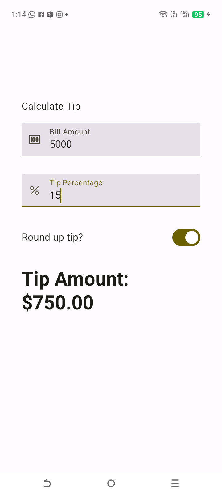

# 💸 Tip Calculator App

## 🌟 Project Overview
The **Tip Calculator** is a highly functional application that introduces advanced user input handling and real-time calculations. It allows users to enter a bill amount, specify a tip percentage, and choose whether to round up the final tip.

This project is a deep dive into **State Management**, **Keyboard Actions**, and **Reusable Input Components**.

---

## 🛠️ What I Learned (Key Concepts)

### 1. **Advanced State Management**
I managed multiple states simultaneously:
- `amountInput`: The raw bill amount from the user.
- `tipInput`: The custom tip percentage.
- `roundUp`: A boolean state for the rounding toggle.
- I used `toDoubleOrNull()` to safely handle cases where the user might enter invalid characters, ensuring the app doesn't crash.

### 2. **Keyboard Customization (`ImeAction`)**
I learned how to make the user experience smoother by controlling the soft keyboard:
- **`ImeAction.Next`**: Automatically moves the focus from the "Bill Amount" field to the "Tip Percentage" field.
- **`ImeAction.Done`**: Closes the keyboard once the user finished entering data.
- **`KeyboardType.Number`**: Ensures only the numeric keypad is shown to the user.

### 3. **Reusable Input Components**
Instead of repeating code, I created a generic `EditNumberField` composable.
- It accepts `@StringRes label` and `@DrawableRes leadingIcon` as parameters.
- This makes it easy to create multiple text fields with different icons while keeping a consistent style.

### 4. **State Hoisting**
I practiced **State Hoisting** by moving the state variables up to the `TipCalculatorApp` function. This makes the `EditNumberField` and `RoundTheTipRow` functions "Stateless," meaning they are easier to test and reuse.

### 5. **Scrollable Layouts**
I used `.verticalScroll(rememberScrollState())` to ensure that if the user's phone has a small screen or if the keyboard takes up too much space, they can still scroll down to see the final tip amount.

---

## 💡 The "Switch Alignment" Fix (Learning Note)

While building the `RoundTheTipRow`, I encountered a common layout issue where the Switch was not centered vertically with the text. 
**The Lesson:** Never apply the parent's `modifier` parameter directly to internal children if that modifier contains external padding or offsets. Instead, use a fresh `Modifier` for internal elements to maintain independent control over their alignment.

---

## 🚀 How the Code Works
1.  **Input Collection**: User types the bill and tip percentage.
2.  **Validation**: The strings are converted to numbers (or 0.0 if empty).
3.  **Calculation**: The `calculateTip` logic runs every time a state changes (Recomposition).
4.  **Formatting**: I used `NumberFormat.getCurrencyInstance()` to display the result in the user's local currency format (e.g., $10.00).

---

## 📸 Final Look

  

---
*“Good apps calculate correctly; Great apps feel smooth while doing it.”* 💸✨
