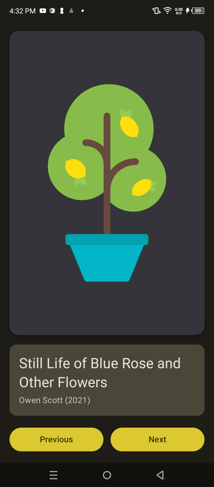

# Art Space App 🎨

## Overview
Art Space is a digital gallery application designed to showcase various artworks in a clean, elegant, and responsive interface. This project focuses on mastering layout management and component-based UI design in Jetpack Compose.

## What I Learned 🚀
Building this application provided deep insights into modern Android UI development:

*   **Modular Component Architecture:** I learned how to decompose a complex screen into smaller, specialized composables (`ArtworkImageCard`, `ArtworkInfoCard`, `ArtworkNavigationButtons`). This makes the code more readable, maintainable, and testable.
*   **Flexible Layouts with Modifiers:**
    *   Using `Modifier.weight(1f)` to allow the artwork image to dynamically fill available vertical space while keeping other elements visible.
    *   Implementing `safeDrawingPadding()` to ensure the UI respects system bars and avoids cutouts.
    *   Applying `Arrangement.spacedBy()` for consistent spacing between interactive elements.
*   **Material 3 Surface & Cards:** Mastering the use of `Card` components with custom `elevation`, `shapes` (`RoundedCornerShape`), and `colors` to create a tiered visual hierarchy.
*   **Image Scaling:** Using `ContentScale.Fit` within a `Box` container to ensure artworks maintain their aspect ratio across different device dimensions.
*   **Theme Integration:** Leveraging `MaterialTheme.colorScheme` and `MaterialTheme.typography` to ensure the app remains consistent with the project's overall design system and supports dark mode effortlessly.

## How the App Looks 📱

The UI features a polished dark-themed gallery view with a prominent artwork display, clear metadata attribution, and intuitive navigation controls.

| Art Space Gallery |
| :---: |
|  |

## Key Components
1.  **Artwork Image Card:** A elevated card that hosts the masterpiece, providing a "physical" feel to the digital art.
2.  **Information Card:** A distinct section using `surfaceVariant` colors to present the title, artist name, and year of creation.
3.  **Interactive Navigation:** A row of weighted buttons that provide a balanced and easy-to-tap interface for browsing the collection.

---
*Created as part of the Jetpack Compose Learning Journey.*
